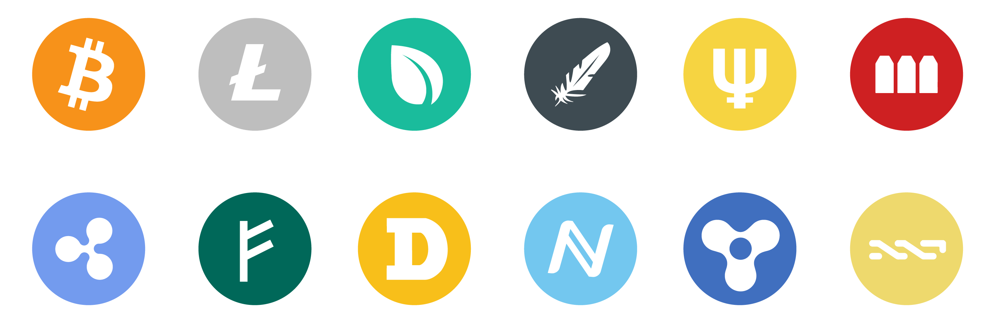
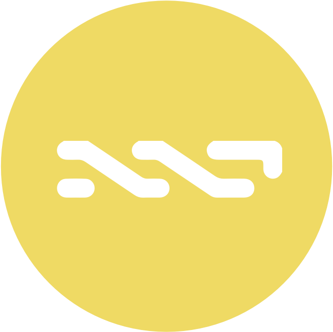
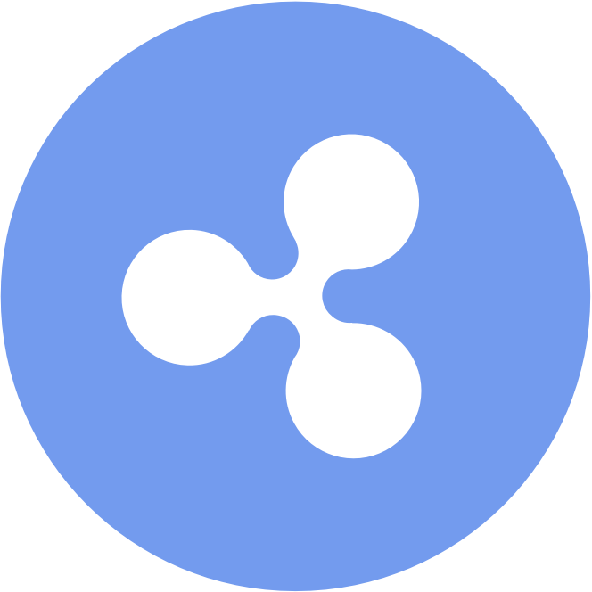

#[Crypto Icons v1.2](http://shphrd.com/crypto-icons)

###An icon pack for the most popular crypto currencies today.  
Crypto Icons are scalable vector graphics that can be used on your websites or apps. Created and
maintained by [Chris Shepherd](http://twitter.com/cshphrd).

--

### Bitcoin

| [Bitcoin](http://bitcoin.org)
|:---:|
|  |

### Litecoin

| [Litecoin](http://litecoin.org)
|:---:|
|  |

### Peercoin

| [Peercoin](http://www.peercoin.net)
|:---:|
|  |

### Dogecoin

| [Dogecoin](http://dogecoin.com)
|:---:|
|  |

### Nxt

| [Nxt](http://www.nxtcommunity.org)
|:---:|
|  |

### Namecoin

| [Namecoin](http://namecoin.info)
|:---:|
|  |

### Ripple

| [Ripple](https://ripple.com)
|:---:|
|  |

### Auroracoin

| [Auroracoin](http://auroracoin.org)
|:---:|
|  |

### Quark

| [Quarkcoin](http://www.qrk.cc)
|:---:|
|  |

### Primecoin

| [Primecoin](http://primecoin.io)
|:---:|
|  |

### Feathercoin

| [Feathercoin](https://www.feathercoin.com)
|:---:|
|  |

### Megacoin

| [Megacoin](http://megacoin.co.nz)
|:---:|
|  |

##Changelog
- v1.2 - Cleaned up src files, exported more coins, updated readme.
- v1.1 - Colors! More coins supports Dogecoin, Ripple, Primecoin, Feathercoin, Auroracoin, NXT, and Megacoin. 
- v1.0 - Added top five crypto coin icons. Currently includes Bitcoin, Litecoin, Peercoin, Namecoin and Quarkcoin.

##Author
- Email: chris@shphrd.com
- Twitter: http://twitter.com/cshphrd
- GitHub: https://github.com/shphrd

##Support

- **BTC:** 1DmKSveQm9MXMjqUGvaVXZgViNZuSx7Npi
- **LTC:** LZLWQV1nQZoWvj8CiK2hMQ1bosntT1xkPm
- **DOGE** DLdiRd5LtxefkgKeBgXnVBiAjv2bTnfYzj
- **PPC:** PADhWNeQw3owGD8N25BDVeQh8C1z94PEsu

## License
[Creative Commons Attribution-ShareAlike 4.0 International](https://creativecommons.org/licenses/by-sa/4.0/deed.en_US)